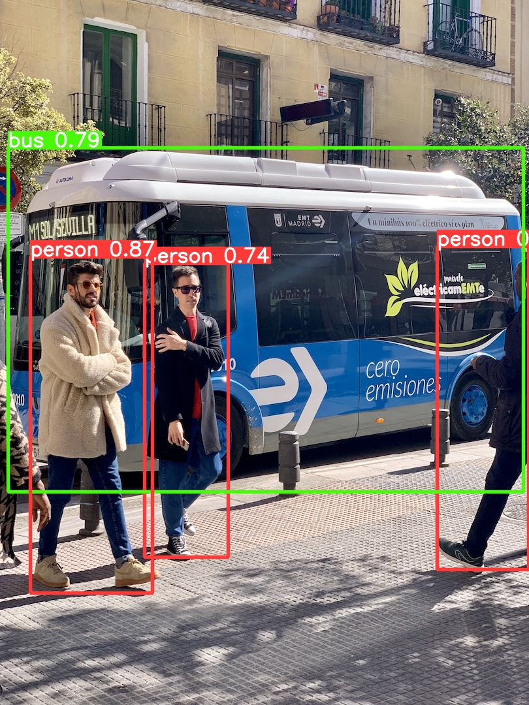

# YOLO Safety Helmet Detection

## Development Guide
- Run `make setup` to setup the development environment, and follow the instructions to setup datasets
- Run `make` to run the project.  For now, it will retrain the yolov8 model and make prediction for the [bus.jpg](./src/assets/img/bus.jpg) like the following:

    

## Object Detection Model

### Data Preprocessing
- TODO

### Model Training
- TODO

### Model Evaluation
- TODO

### Model deployment with edge computing
- TODO

