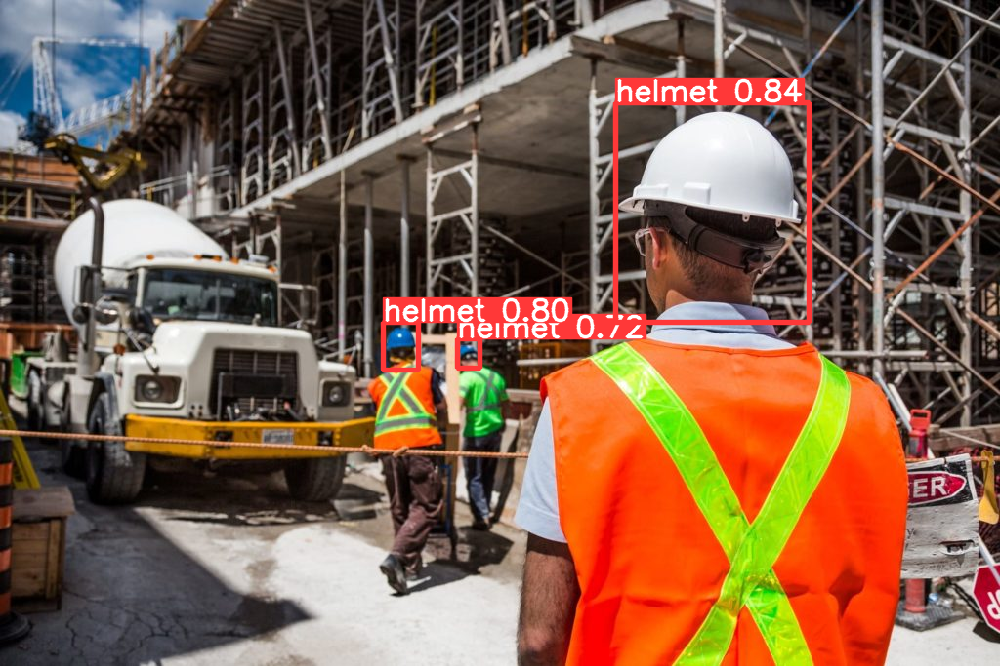

# YOLO Safety Helmet Detection

## Onboarding Guide
- Run `make setup` to setup the development environment, and follow the instructions to setup datasets
- To get a taste of the training and prediction process of the YOLOv5 model, run `make yolo` to train a YOLOv5 model on coco8 dataset, and make prediction for the [bus.jpg](./src//assets//img//bus.jpg) like the following

  

- [For reference] Run `make clean` to clean the project setup, including the Python virtual environment and the runs folder generated by YOLO

## Model Training
- Upload `src/notebook/train.ipynb` to Google Colab, and run the notebook to train the model
- Custom model has been trained and saved as `yolov5_custom_ds3_35.pt` in `src/assets/models` folder

## Model Prediction
- Run `make predict-img` to run a demo of the custom YOLOv5 model on a image, which will make prediction on the [helmet.jpg](./src/assets/img/helmet.jpg) like the following

  

- Run `make predict-video` to run a demo of the custom YOLOv5 model on a video, which will make prediction on the [video.mp4](./src/assets/video/video.mp4) like the following

    

- Run `make camera-detect` to run a demo of the custom YOLOv5 model on webcam, which will make prediction in real-time

## Deployment to NVIDIA Jetson Nano
1. Git clone this repository to the Jetson Nano
2. cd into the `jetson-nano-workspace` folder
3. Install all python dependencies specified in `yolov5_csi/requirments.txt`
4. Run `make detect` to run the custom YOLOv5 model on the Jetson Nano and make real-time prediction for the video stream from the CSI camera

### References
- [Deploy on NVIDIA Jetson using TensorRT and DeepStream SDK](https://docs.ultralytics.com/yolov5/tutorials/running_on_jetson_nano/)
- [L-5 YOLOv5 on Jetson Nano | PyTorch & TorchVision Installation on Jetson Nano](https://www.youtube.com/watch?v=ZXbOV83EXdQ)
- [Estimating position of the objects using Jetson Nano and YOLOv5](https://www.youtube.com/watch?v=oKaLyow7hWU)

